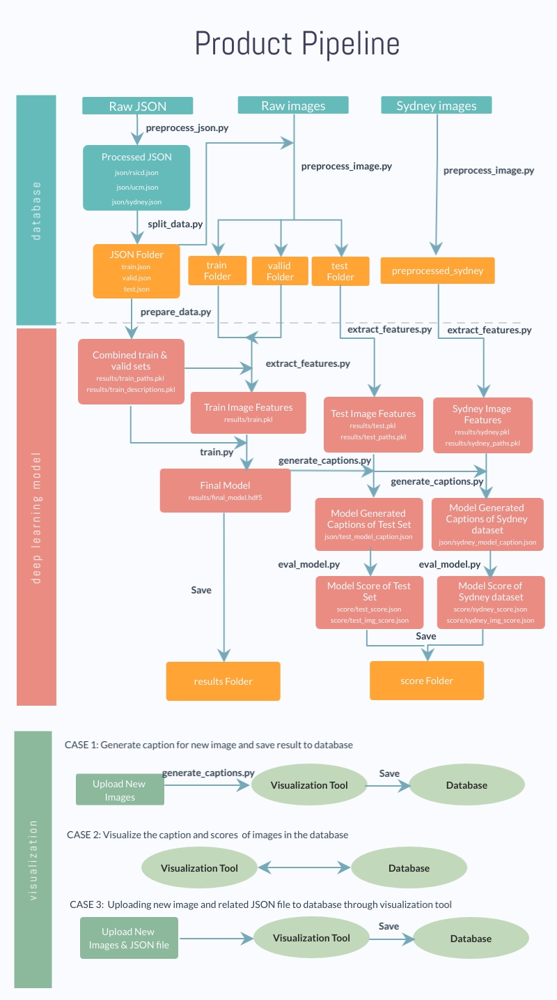

# MDA-MDS Capstone Project: Image Captioning of Earth Observation Imagery

***Creators**: Dora Qian, Fanli Zhou, James Huang, Mike Chen*

***MDS Mentor**: Varada Kolhatkar*

***MDA Partners**: Andrew Westwell-Roper, Shun Chi*

## Summary

MDA is a Canadian aerospace company, manufacturing equipment for space applications, specializing in space surveillance, space robotics, and satellite systems. MDA has access to a vast database of uncaptioned overhead satellite images, and they are interested in assigning captions to these images for image indexing, more specifically for detection of events of interest; these captions will describe objects in the photo and how they interact. In this project, we have created a complete image captioning pipeline consisting of three independent modules: a database, a deep learning model and an interactive visualization and database updating tool.


The following pipeline chart displays the workflow used in our pipeline.


## Installation instructions

**Option 1: Running the whole pipeline**
  - An AWS S3 bucket needs to be set up as the database, please follow the instruction [here](https://docs.aws.amazon.com/AmazonS3/latest/gsg/CreatingABucket.html) to create a S3 bucekt.
  - An AWS EC2 P3 instance needs to be set up to run the pipeline, please follow the EC2 installation instructions [here](docs/ec2_installation_steps.md).

**Option 2: Using the visualization tool with our pre-trained model and results**
  - You can run the visualization tool locally with the following dependencies installed on your machine.
  - You need have the same packages installed on your machine as the ones in our AWS installation instruction [here](docs/ec2_installation_steps.md)

## Preparing the database

We have prepared two google drive links for users to download the data. Please follow the steps below to download the data and prepare the database.

**Option 1: Running the whole pipeline**
1. Download the data [here](https://drive.google.com/file/d/1TXo137cJqutrHAJYOeaECAm_sMJJRPZX/view?usp=sharing), only raw data is included in the zip file.
2. Unzip the downloaded file
3. Upload the data foler to your S3 bucket, you can either do it manually on S3 website or use the following script in terminal.
```
# make sure you replace {bucket_name} with your S3 bucket name
aws s3 sync data s3://{bucket_name}
```
4. Launch your AWS EC2 P3 instance
5. Download this github repository to root directory of your gpu machine by typing the following script in terminal. You will be asked to provide your github account and password to access our repository.

```
git clone https://github.com/UBC-MDS/591_capstone_2020-mda-mds.git
```

6. Sync your S3 bucket as data folder under this repository by typing the following scripts in terminal.

```
cd 591_capstone_2020-mda-mds
aws s3 sync s3://{bucket_name} data
```

**Option 2: Using the visualization tool with our pre-trained model and results**
1. Download the data [here](https://drive.google.com/file/d/1_6N7c7tXoEr5FSWgalxjBnxIPqrzGXmB/view?usp=sharing), all the raw data, trained model, model results and scores are included in the zip file.
2. Unzip the downloaded file
3. Upload the data folder to your S3 bucket, you can either do it manually on S3 website or use the following script in terminal.
```
# make sure you replace {bucket_name} with your S3 bucket name
aws s3 sync data s3://{bucket_name}
```
4. Download this github repository to your local machine by typing the following script in terminal. You will be asked to provide your github account and password to access our repository.

```
git clone https://github.com/UBC-MDS/591_capstone_2020-mda-mds.git
```

5. Sync your S3 bucket as data folder under this repository by typing the following scripts in terminal.

```
cd 591_capstone_2020-mda-mds
aws s3 sync s3://{bucket_name} data
```

## Runnning the pipeline

**Make**
We need GNU Make to run the makefile and it should be already installed on your GPU. Type `make -v` in your terminal to ake sure if you have it installed.

**Steps**
1. To clean up all the intermediate and results files, and prepare a clean environment to run the pipeline, please type the following command in terminal. The whole process will run approximately from 1 to 1.5 hours.
```
make clean
```
2. To run the whole pipeline, please type the following command in terminal.
```
make all
```
The following usages are allowed to run any speicific part of pipeline:
```
# To prepare the data for model training
make data

# To train the model
make train

# To generate captions
make caption

# To evaluate the results and get scores
make score
```
3. After the pipeline is finished, please sync the data folder back to your S3 bucket using the following script.
```
aws s3 sync data s3://{bucket_name}
```

## Running the Visualization Tool

Before running the Visualization Tool, enter AWS Credentials (`ACCESS KEY` and `SECRET ACCESS KEY`) and S3 Bucket Name in `591_capstone_2020-mda-mds/scr/visualization/mda_mds/mda_mds/STATIC_VARIABLES.json`. Please paste in your credentials into the appropriate key-value pair.

**Option 1: Running the whole pipeline**

After you updates all your results and scores in S3 bucket, you can continue to run the visualization tool on your AWS EC2 instance.

1. From the root of the repo, open `scr/visualization/mda_mds/mda_mds/settings.py`.
2. Add `[public domain name].ca-central-1.compute.amazonaws.com` to `ALLOWED_HOSTS`
For example:
```
ALLOWED_HOSTS = ['ec2-3-96-51-16.ca-central-1.compute.amazonaws.com', 'localhost', '127.0.0.1']
```
3. Save and exit, navigate to `scr/visualization/mda_mds/` and call
```
python manage.py runserver [public domain name].ca-central-1.compute.amazonaws.com:[port]
```
For example:
```
python manage.py runserver ec2-3-951-16.ca-central-1.compute.amazonaws.com:8443
```
You can define the port number when you launch the EC2 instance when setting the `Security Groups` by adding `Custom TCP Rule` and setting the `Port Range` to the port number. If you launched an instance in the `sg-4a03c42a` group, then the port number is `8443`.

4. Open `http://[public domain name].ca-central-1.compute.amazonaws.com:[port]` in Chrome.

For example: `http://ec2-3-96-51-16.ca-central-1.compute.amazonaws.com:8443`

**Option 2: Using the visualization tool with our pre-trained model and results**

To run the visulaization tool locally with our pre-trained model and results, please using the following scripts in your terminal:

```
cd ./591_capstone_2020-mda-mds/scr/visualization/mda_mds
python manage.py runserver
```

## Uploading new data
The steps bewlow demonstrate how to upload a new dataset named "new".
### 1. Preparing the new data image folder
  - Place all the images into a new folder with folder name as "new"
  - You should now have all new images under `data/raw/new`
### 2. Preparing the new json file
  - The human-annotated caption associating with the new images should be uploaded using the template below.
  - An example json file can be found [here](docs/upload_template.json)
```
# below is an example of json file for uploading 2 new images
{"new1.jpg":
    {"imgid": 1,
    "sentences": [{"raw": "caption 1.",
                  "tokens": ["caption", "1", "."],
                  "imgid": 1, "sentid": 11},
                  {"raw": "caption 2.",
                  "tokens": ["caption", "2", "."],
                  "imgid": 1, "sentid": 12},
                  {"raw": "caption 3.",
                  "tokens": ["caption", "3", "."],
                  "imgid": 1, "sentid": 13},
                  {"raw": "caption 4.",
                  "tokens": ["caption", "4", "."],
                  "imgid": 1, "sentid": 14},
                  {"raw": "caption 5.",
                  "tokens": ["caption", "5", "."],
                  "imgid": 1, "sentid": 15}]},
"new2.jpg":
    {"imgid": 2,
    "sentences": [{"raw": "caption 1.",
                  "tokens": ["caption", "1", "."],
                  "imgid": 2, "sentid": 21},
                  {"raw": "caption 2.",
                  "tokens": ["caption", "2", "."],
                  "imgid": 2, "sentid": 22},
                  {"raw": "caption 3.",
                  "tokens": ["caption", "3", "."],
                  "imgid": 2, "sentid": 23},
                  {"raw": "caption 4.",
                  "tokens": ["caption", "4", "."],
                  "imgid": 2, "sentid": 24},
                  {"raw": "caption 5.",
                  "tokens": ["caption", "5", "."],
                  "imgid": 2, "sentid": 25}]}}
```
  - After you have the json file ready, please name it with the same name as your image folder (i.e. new.json) and save it under the same folder
  - You should now have the json as `data/raw/new.json`

### 3. Sync with S3 bucket
- **Option 1 Manually sync**:
  - Sync your S3 bucket as data folder under this repository by typing the following scripts in terminal.
```
# under root directory of this repo folder
aws s3 sync data s3://{bucket_name}
```
- **Option 2 Using visualization tool**:
  - You can upload all the images and json file using the 3rd tab "Database Upload" on our visualization tool
  - Make sure you select all the images and one single json with their associating human-annotated captions

### 4. Add new dataset to train/valid/test sets
  - You can now choose to use this new dataset for training/validation/testing purpose
  - Go to [Makefile](Makefile)
  - You need to modify the variables in Makefile from line 27 to line 38

  **Case 1: To add the new dataset to combined datasets before train/valid/test split, replace the line 27-38 with the scripts below**
  ```
  # define the json files to process
  json_to_process := rsicd ucm sydney new
  # define the json file to combine for train/valid/test split
  combine_set := rsicd ucm new
  # define the image folders to combine for train/valid/test split
  combine_img := raw/ucm raw/rsicd raw/new
  ```
  **Case 2: To add the new dataset for training only, replace line 27-28, 33-36 with the scripts below**
  ```
  # define the json files to process
  json_to_process := rsicd ucm sydney new
  # define the image folders to preprocess
  img_to_process := raw/sydney raw/new
  # define the datasets to combine for training
  train_set := train valid new
  ```
  **Case 3: To add the new dataset for testing only, replace line 27-28, 33-34, 37-38 with the scripts below**
  ```
  # define the json files to process
  json_to_process := rsicd ucm sydney new
  # define the image folders to preprocess
  img_to_process := raw/sydney raw/new
  # define the datasets to test separately
  test_set := test sydney new
  ```

## Building and re-training the model with new data
- Before running pipeline, you may want to change the final model name in
- Go to [Makefile](Makefile)
- On line 26, you can define any model name
```
final_model := final_model_new
```
- Then, you can run the pipeline by typing `make all` in the terminal.
- The trained model will be saved under results folder with the name `final_model_new.hdf5`

## Modify models

- To change models structures, modify   `591_capstone_2020-mda-mds/scr/models/model.py`.

- To change feature vectors extracted from CNN, modify `591_capstone_2020-mda-mds/scr/models/extract_features.py`.

- To change training process, modify `591_capstone_2020-mda-mds/scr/models/train.py`.