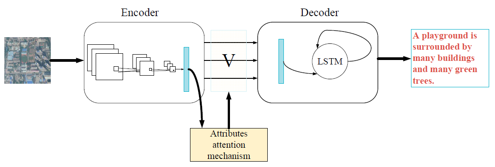

```{r setup, include=FALSE}
knitr::opts_chunk$set(echo = TRUE)
library(rjson)
library(knitr)
library(tidyverse)
library(ggthemes)
library(cowplot)
#theme_set(theme_cowplot())
```

```{r load data, echo=FALSE, message=FALSE}
baseline <- fromJSON(file = "../models/final_results_n9.1.3.2.json") %>%
  as.data.frame()
attention <- fromJSON(file = "../models/final_results_n16.2.json") %>%
  as.data.frame()
multi_attention <- fromJSON(file = "../models/final_results_n19.2.json") %>%
  as.data.frame()

test <- rbind(baseline[1:9], attention[1:9], multi_attention[1:9])
colnames(test) <- c("BLEU 1", "BLEU 2", "BLEU 3", "BLEU 4", "Meteor", "ROUGE L", "CIDEr", "SPICE", "USC Similarity")
rownames(test) <- c("Baseline", "Attention", "Multi-Attention")
test <- round(test, 3)

sydney <- rbind(baseline[10:18], attention[10:18], multi_attention[10:18])
colnames(sydney) <- colnames(test)
rownames(sydney) <- rownames(test)
sydney <- round(sydney, 3)
```

*MDS Mentor: Varada Kolhatkar*

*MDA Partners: Andrew Westwell-Roper, Shun Chi*


## Data Science Method 

### Model

Image captioning has been a popular problem in recent years and several state-of-the-art deep learning models have been proposed in the literature for this problem.  We focused on the encoder-decoder model as it is the most common method for image captioning. Here are the three model architectures we tried:

1. Our baseline architecture combines CNN and LSTM. At each step during generation, we combine the LSTM output with the image feature vector and pass the result through a dense layer and an output layer to generate the next word, which is fed back as input to the LSTM layer in the next step.

This model architecture is relatively simple and easy to optimize. But the image features used in this model is a high-level image summary and may not carry enough information for a good caption. Based on literature, adding attention layers can improve image captioning. So, we tried two model architectures with attention layers.

```{r echo=FALSE, out.width='100%'}
knitr::include_graphics('../imgs/model_1.png')
```

Figure 3. The baseline model architecture (adapted from [@Lu_2018]).


2. Our second model architecture has an attention layer on top of the baseline model (Figure 4). Attention is an interface between the CNN and LSTM that provides the LSTM with weighted image features from the CNN convolutional layer. Overall, the model can selectively focus on useful parts of the input image and align image features with words [@xu2015attend; @zhang_2019].

```{r echo=FALSE, out.width='100%'}

```

Figure 4. The second model architecture (adapted from [@zhang_2019]).

3. As an extension of the second model, the third model architecture  contains three attention structures on top of the baseline model (Figure 5). This multi-level attention model better mimics human attention mechanisms and act as moving the focus between the image and the word context to help generate better captions [@li_2020]. 


```{r echo=FALSE, out.width='100%'}
knitr::include_graphics('../imgs/model_3.png')
```

Figure 5. The third model architecture (adapted from [@li_2020]).


### Transfer Learning

For each model structure, we use heavy transfer learning. Given an image, we extracted a feature vector from the pre-trained [`InceptionV3` or `vgg16` model](https://pytorch.org/docs/stable/torchvision/models.html), a CNN trained on `ImageNet`. For LSTM, we used an embedding layer and initialized embedding weights with pre-trained `GloVe` ([`glove.6B.200d`](https://nlp.stanford.edu/projects/glove/)) or `Wikipedia2Vec` ([`enwiki_20180420_500d`](https://wikipedia2vec.github.io/wikipedia2vec/)) embeddings. Pre-trained models or embedding weights were trained on a large dataset and achieved good performance. Incorporating pre-trained models or embedding weights is simple and can reduce training time. The caveat is that the performance depends on task similarity.


### Evaluation

To assess those models, we used `USC Similarity` and `SPICE` to evaluate semantic similarity and some other metrics to evaluate syntactic similarity based on `n-gram` comparison, including `BLEU 1`, `BLEU 2`, `BLEU 3`, `BLEU 4`, `Meteor`, `ROUGE_L`, and `CIDEr` [@li_2020]. All scores range from zero to one, except the `CIDEr` score, which ranges from zero to ten.

As shown in Table 1, when testing on a dataset like the training data, the baseline model achieves better scores than other models. Those scores are comparable to scores in literature [@li_2020]. But models with attention layers did not improve the performance. It could be that we didn’t spend enough time fine tuning those models. But MDA is more interested in building a working end-to-end pipeline than getting the state-of-the-art results. So instead of further optimizing the models, we decided to spend more time on the pipeline and just used this baseline model in our final data product.

```{r test scores, echo=FALSE}
kable(test, 
      caption = "Table 1. Evaluation scores from the best model of each structure on the test dataset (Combined RSICD and UCM datasets).")
```


To test the model generalization capability, we tested our models on the `Sydney` dataset that is different from the training data. As shown in Table 2, the baseline model has the best scores, but all scores are lower than scores when testing on a similar dataset in Table 1. It indicates that the models have poor generalization capabilities. 

```{r sydney scores, echo=FALSE}
kable(sydney, 
      caption = "Table 2. Evaluation scores from the best model of each structure on the Sydney dataset.")
```


### Other Considerations

Besides, we tried to train our own CNN classifiers based on labeled satellite images but the performance could not beat the pre-trained CNN models. We also tried to train embeddings using our training captions and then tested the embeddings by predicting cosine similarity between words. Again, we found that pre-trained embeddings perform better than embeddings learned from scratch. So we decided to use pre-trained CNN models and embeddings.

### Future Improvements

Models with attention layers have great potential. We could further improve the performance of those models. If we have time, we could try optimizing hyperparameters, fine tuning the pre-trained CNN, extracting features from different convolutional layers, and improving attention structures.


## References


