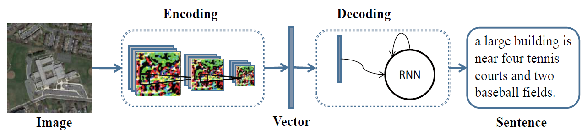
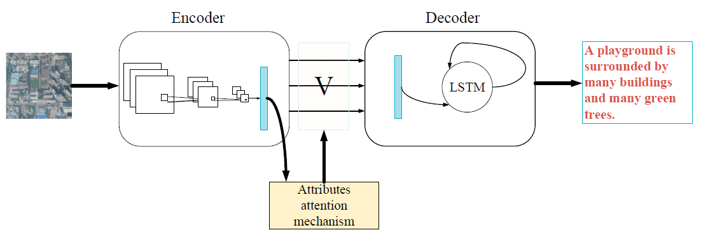
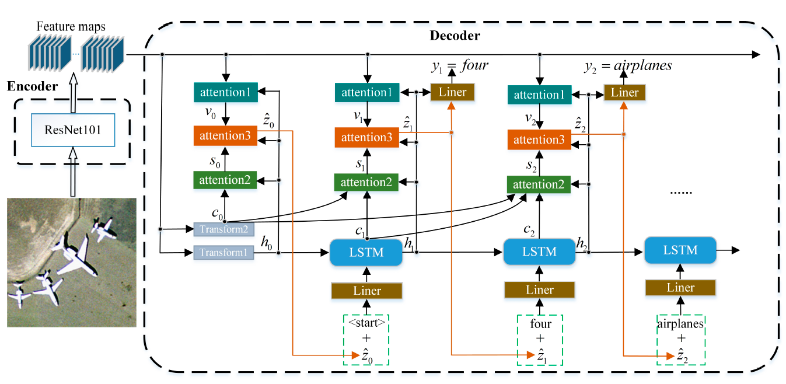
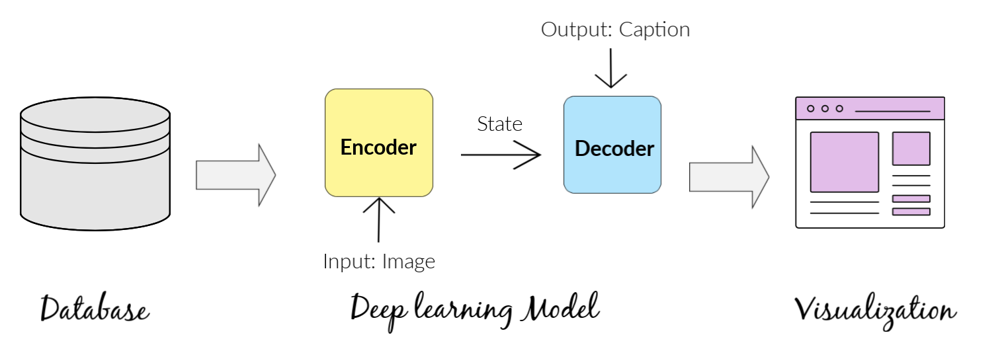
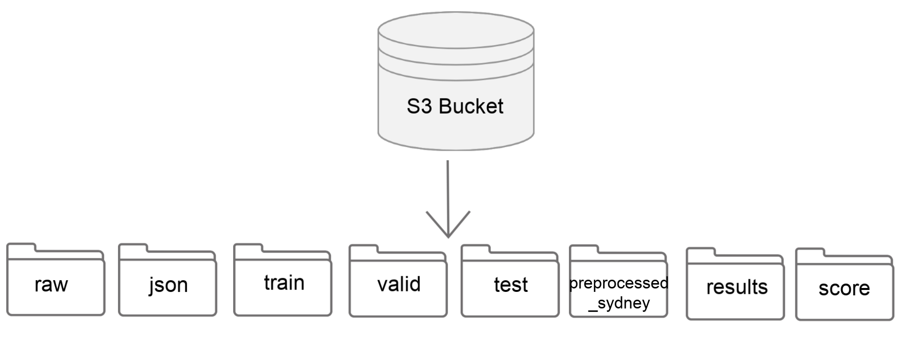
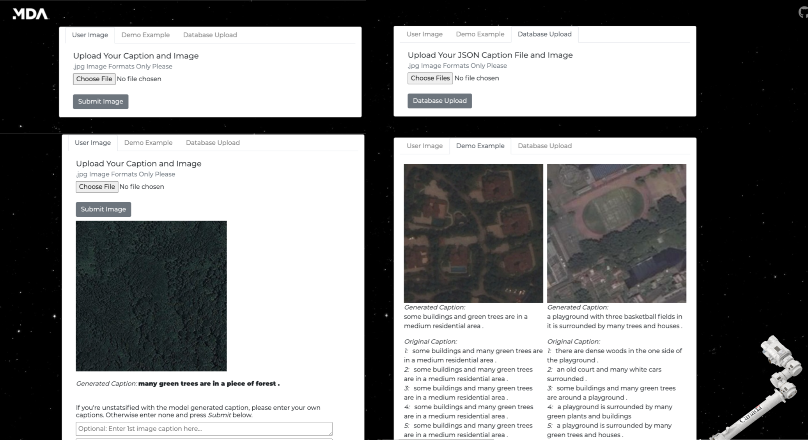

```{r setup, include=FALSE}
knitr::opts_chunk$set(echo = TRUE)
library(rjson)
library(knitr)
library(tidyverse)
library(ggthemes)
library(cowplot)
```


```{r load data, echo=FALSE, message=FALSE}
baseline <- fromJSON(file = "../models/final_results_n9.1.3.2.json") %>%
  as.data.frame()
attention <- fromJSON(file = "../models/final_results_n16.2.json") %>%
  as.data.frame()
multi_attention <- fromJSON(file = "../models/final_results_n19.2.json") %>%
  as.data.frame()

test <- rbind(baseline[1:9], attention[1:9], multi_attention[1:9])
colnames(test) <- c("Bleu-1", "Bleu-2", "Bleu-3", "Bleu-4", "Meteor", "Rouge_L", "CIDEr", "SPICE", "USC_Similarity")
rownames(test) <- c("CNN + LSTM", "Attention", "Multi-Attention")
test <- round(test, 3)

sydney <- rbind(baseline[10:18], attention[10:18], multi_attention[10:18])
colnames(sydney) <- colnames(test)
rownames(sydney) <- rownames(test)
sydney <- round(sydney, 3)
```

*MDS Mentor: Varada Kolhatkar*

*MDA Partners: Andrew Westwell-Roper, Shun Chi*

## Executive Summary

MDA is a Canadian aerospace company that manufactures equipment for space applications and specializes in space surveillance, space robotics, and satellite systems. The company has a vast database of uncaptioned overhead satellite images and wants to caption these images for indexing and detecting events of interest. In this project, we created a pipeline that processes raw satellite image-caption pairs and trains a deep learning model that creates a natural language descriptive caption given an image. We evaluated the model using several n-gram-based and semantic-based metrics. Our evaluation results show that our model can achieve a `Bleu-1` score of 0.648 and a `USC_Similarity` score of 0.612. To better organize the data, we built a non-relational database that stores the raw data and model results on an AWS S3 bucket. We also developed an interactive visualization tool that allows the user to examine model generated captions and upload image-caption pairs to the database.

## Introduction

Image captioning aims to generate sentences describing objects and actions in the image. It is more dynamic than image classification, which aims to classify images as predetermined classes. Image captions can be used for indexing to query images and evaluate image similarity and describing images to the visually impaired. Currently, most available image captioning models are trained on the `ImageNet` dataset. Different from images in the `ImageNet` dataset, satellite images usually have strange views and many components. So those available image captioning models may be less effective as we are working on a different domain. In this project, we produced a data product to help MDA solve this problem.

We broke down the problem into three parts. First, designing a database structure: we need to organize the raw data and model results and standardize the JSON structure to store captions for reproducibility. Second, developing a deep learning model for image captioning: we train the model with image-caption pairs and evaluate the model with metrics that measure the sentence similarity. Third, developing a visualization tool, which allows the user to generate captions for new images, optionally enter better captions if they are not satisfied with the predicted caption, view model generated captions with evaluation scores for sample images from our test set, and upload image-caption pairs to the database.

### Data Description

Given that MDA's images are uncaptioned, we used three labeled public datasets of satellite image-caption pairs to train our model: UCM-captions [@Qu_2016], RSICD  [@xu2018] and Sydney-captions [@Qu_2016]. There are 13,634 images in total with five captions describing each image in these datasets. 

The UCM-captions dataset is based on the “University of California Merced’s Land Use Dataset”. It contains land-uses satellite images and has 21 different classes of images  (2100 images). The Sydney-captions dataset is extracted from a large 18000 X 14000-pixel image of Sydney taken from Google Earth and it has seven different classes of images (613 images). The RSICD dataset is a large-scale and popular aerial image dataset. Its images are sourced from BaiduMaps, GoogleMaps, and Tianditu, and the captions are sourced from different volunteers to ensure diversity of the caption (10,922 images).

We combined UCM-captions and RSICD datasets and split the combined dataset into training (64%), validation (16%), and test (20%) sets. The Sydney-captions dataset is set aside for testing model generalization capability. We trained and tuned our models using the training and validation set, and tested our final model with test set and Sydney-captions dataset. 

## Data Science Methods

### Model

Image captioning has been a popular problem in recent years and several state-of-the-art deep learning models have been proposed in the literature for this problem. In this project, we focused on the encoder-decoder model as it is the most common method for image captioning. Here are the three model architectures we tried:

1. Our first architecture combines CNN and LSTM (Figure 1, [related notebooks](../notebooks/fz-cnn_lstm_models)). At each step during generation, we combine the LSTM output with the image feature vector and pass the result through a dense layer and an output layer to generate the next word, which is fed back as input to the LSTM layer in the next step.

This model architecture is relatively simple and easy to optimize. But the image features used in this model only represent a high-level image summary and may not carry enough information for a good caption. Based on the literature, adding attention layers can improve image captioning. So, we tried two model architectures with attention layers.

```{r echo=FALSE, out.width='80%'}

```

Figure 1. The CNN + LSTM model architecture (adapted from [@Lu_2018]).


2. Our second model architecture has an attention layer on top of the CNN + LSTM model (Figure 2, [related notebooks](../notebooks/fz-attention_models)). Attention is an interface between the CNN and LSTM that provides the LSTM with weighted image features from the CNN convolutional layer. Overall, the model can selectively focus on useful parts of the input image and align image features with words [@xu2015attend; @zhang_2019].

```{r echo=FALSE, out.width='80%'}

```

Figure 2. The second model architecture (adapted from [@zhang_2019]).

3. As an extension of the second model, the third model architecture contains three attention structures on top of the CNN + LSTM model (Figure 3, [related notebooks](../notebooks/fz-multi-attention_models)). This multi-level attention model better mimics human attention mechanisms and act as moving the focus between the image and the word context to help generate better captions [@li_2020]. 


```{r echo=FALSE, out.width='80%'}

```

Figure 3. The third model architecture (adapted from [@li_2020]).


### Transfer Learning

For each model architecture, we used heavy transfer learning. Given an image, we extracted a feature vector from the pre-trained [`InceptionV3` or `vgg16` model](https://pytorch.org/docs/stable/torchvision/models.html), a CNN trained on `ImageNet`. For LSTM, we used an embedding layer and initialized embedding weights with pre-trained `GloVe` ([`glove.6B.200d`](https://nlp.stanford.edu/projects/glove/)) or `Wikipedia2Vec` ([`enwiki_20180420_500d`](https://wikipedia2vec.github.io/wikipedia2vec/)) embeddings. Pre-trained models or embeddings were trained on a large dataset and achieved good performance. Incorporating pre-trained models or embeddings is simple and can reduce training time. The caveat is that the performance depends on task similarity.

### Evaluation Metrics

Evaluating the quality of machine-generated captions is challenging as there exist many possible ways to describe an image and there is no one correct way.

To examine our model performance, we have used two types of evaluation metrics: n-gram-based and semantic-based metrics. In total, nine different evaluation metrics are used in the evaluation stage.

N-gram based metrics include [`Bleu 1-4`](https://www.aclweb.org/anthology/P02-1040.pdf) [@papineni-etal-2002-bleu], [`Rouge_L`](https://www.aclweb.org/anthology/W04-1013.pdf) [@lin-2004-rouge], [`Meteor`](https://www.cs.cmu.edu/~alavie/METEOR/pdf/Banerjee-Lavie-2005-METEOR.pdf) [@denkowski-lavie-2014-meteor], and [`CIDEr`](https://arxiv.org/pdf/1411.5726.pdf) [@7299087]. These metrics are commonly used in the natural language processing community and related research papers. `Bleu` score counts the occurrence of n-grams of generated captions in the reference captions and is precision-based. Similar to the `Bleu` score, `Rouge_L` is recall-based and calculated as an F-measure using the longest common subsequences. `Meteor` is generated by using alignments between reference and generated captions. `CIDEr` is the newest one which is proven to have a more human consensus as it incorporates TF-IDF weights in the calculation. We used the defense version of `CIDEr` in our evaluation script. The main problem with the n-gram based metrics is that they are sensitive to word overlapping. However, for two captions to have the same meaning, word overlapping is not necessary. Moreover, MDA is more interested in the semantic meaning of the caption, therefore we have included two semantic-based metrics.

Semantic-based metrics include Universal Sentence Encoder similarity (i.e. [`USC_Simialrity`](https://tfhub.dev/google/universal-sentence-encoder-multilingual-large/3)) and [`SPICE`](https://arxiv.org/pdf/1607.08822.pdf)[@spice2016]. `USC_Similarty` first encodes any caption into a matrix using their pre-trained multi-language model and then computes the inner product of any two captions. `SPICE` parses a caption into a semantic scene graph that lists all the objects, attributes, and relations in the sentences and then computes graph similarity.

By incorporating both n-gram and semantic-based metrics, we have a more comprehensive view of model performances. All scores range from zero to one, except that the `CIDEr` score ranges from zero to ten.

### Results

Table 1 shows all metrics scores for the best model of each model architecture (the complete model comparison results are [here](../notebooks/compare_models/18-fz-compare_models.ipynb)). When testing on a dataset like the training data, the CNN + LSTM model achieves better scores than other models. Those scores are comparable to scores in the literature [@li_2020]. But models with attention layers did not improve the performance. It could be that we did not spend enough time fine-tuning those models. But MDA is more interested in building a working end-to-end pipeline than getting the state-of-the-art results. So instead of further optimizing the models, we decided to spend more time on the pipeline and just used this CNN + LSTM model in our final data product.

```{r test scores, echo=FALSE}
kable(test)
```

Table 1. Evaluation scores from the best model of each structure on the test dataset split from the dataset that combines the RSICD and UCM-captions datasets.

To test the model generalization capability, we tested our models on the Sydney-captions dataset that is different from the training data. As shown in Table 2, the CNN + LSTM model has the best scores, but all scores are lower than the scores in Table 1. It indicates that the models have poor generalization capabilities. Those scores are comparable to scores in the literature [@Lu_2018].

```{r sydney scores, echo=FALSE}
kable(sydney)
```

Table 2. Evaluation scores from the best model of each structure on the Sydney-captions dataset.

### Other Considerations

We trained CNN classifiers from scratch with labeled satellite images but those models did not perform as well as the pre-trained CNN models ([related notebooks](../notebooks/jh-cnn_models)). We also trained embeddings from scratch with training captions and then tested the embeddings by predicting cosine similarity between words ([related notebook](../notebooks/fz-cnn_lstm_models/9.4-fz-cnn_lstm_dataset_v2_compare_embeddings.ipynb)). Again, we found that embeddings learned from scratch did not improve the performance. So we decided to use pre-trained CNN models and embeddings.

### Future Improvements

Models with attention layers have great potential. We could further improve model performance. Given enough time, we could try optimizing hyperparameters, fine-tuning the pre-trained CNN, extracting features from different convolutional layers, and improving attention structures.

## Data Product

The final data product is a complete image captioning pipeline, consisting of 3 independent modules: a database, a deep learning model, and a visualization tool. 

When designing our product pipeline, we have separated the visualization tool from the other two because the visualization tool can be run without GPU. The flowchart describing the whole workflow can be found [here](../imgs/pipeline.jpg). For the main pipeline, we used `GNU make` to create the whole workflow. The process includes preprocessing raw data, training models, generating captions, and evaluating results. All the steps can be executed by using `make all ` command in the terminal. We also allow users to call any specific part of the workflow. For example, `make data` to prepare the data for training and testing. The visualization tool workflow is implemented using `Django`, which interacts with our database and model in three different ways. 

```{r echo=FALSE, out.width='60%'}

```

Figure 4. The final data product.

### Database

The first module is a database. AWS S3 bucket is chosen to be used as our database mainly because it can integrate well with AWS GPU instance that we used for training the model. Other advantage includes great scalability and ease of use. 

To use this database, we provided a private link on google drive for users to download and upload raw data to their S3 bucket as the starting files. After running the whole pipeline, the users should have the database structure as shown below. They will have eight folders containing raw, preprocessed image and JSON files, as well as model results and scores.

```{r echo=FALSE, out.width='60%'}

```

Figure 5. The final database structure.

### Deep Learning Model

The second module is a deep learning model. The final model we used in data product is the CNN + LSTM model with pre-trained `vgg16` CNN and pre-trained `GloVe` embeddings. The model is written in `Pytorch` and trained on an AWS GPU instance. In this module, We allow users to train the model, generate caption, and evaluate the results. After running the pipeline, the user can save the trained model, generated captions, and evaluation scores back to the S3 database.

### Visualization Tool 

For the visualization tool, MDA requires three first functionalities. First, users can upload single images to generate captions, and optionally enter better captions if they are not satisfied with the predicted captions. Second, users can view the training captions, the generated captions, and the evaluation scores for those captions on images from the test set. Third, users can upload multiple images with a `JSON` caption file to S3 database. Overall the visualization tool should provide a user-friendly way to interact with the model and the database. 

To build the visualization tool, we implemented the frontend with `HTML`, `CSS`, and `Javascript` and the backend with `Django`, which is a python-based framework for web development. We have three tabs for the three required features: “User Image” tab for generating captions, “Demo Example” to view results, and “Database Upload” for multiple images uploads. Figure 6 shows screenshots of our visualization tool. Users would click on the tab to complete the relevant task. 

We developed a web app instead of a `Dash` or `Shiny` app due to the following considerations. First, developers in the industry are more familiar with web development technologies, so it may be easier for them to modify the existing app written as a web. Besides, web apps using native technologies, such as `HTML` and `CSS`, run faster than apps using a `Dash` or `Shiny` framework. 

```{r echo=FALSE, out.width='80%'}

```

Figure 6. The visualization tool screenshots.

Numerous improvements can be implemented in the visualization tool. Given more time, we could implement some security features to ensure that the user uploads the correct files or file types. For example, when uploading multiple images, a good security check should be used to check if the image content is legitimate (e.g. the user does not accidentally upload any non-satellite images).

## Conclusion and Recommendations

We have successfully developed a complete image captioning pipeline with all the features proposed in the [proposal report](../docs/proposal.pdf). The performance of our deep learning model on the test dataset is comparable to the state-of-art image captioning models in this domain. However, the generalization capability of the model on the unseen `Sydney-captions` dataset is markedly lower.

Due to the short time of this project, there are some limitations we faced. First, the satellite image datasets we worked with are fairly small compared to other image datasets, which limited our ability to train our own CNN classifier. Second, our attention models did not perform as well as expected. We would like to optimize those models, but in the latter stages of the project, we had to prioritize the pipeline structure over finetuning the models.

Our product has room for improvement and below are our recommendations. First, a CNN classifier tailored to satellite images could be trained by utilizing larger datasets and this could potentially outperform our transfer learning. Second, we believe our third model with multi attention layers has great potentials and could be further experimented on. This model could be improved by optimizing hyperparameters, improving the attention structure, or extracting image features from different convolutional layers of pre-trained CNN models. Last, the model's generalization capability could be further tested by using MDA's private satellite images.

## References


