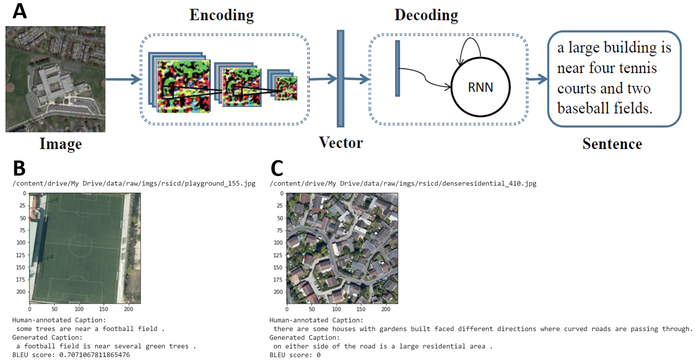

```{r setup, include=FALSE}
knitr::opts_chunk$set(echo = TRUE)
```

## Executive Summary

In our MDS-MDA joint Capstone project, we aim to caption overhead Earth observation images captured by satellites.
 
## Introduction

MDA is an aerospace company, and has access to a vast database of the aforementioned satellite images. These photos in a vacuum and without context do not offer very much information on their own, as people naturally query things with words. Extracting a caption from an image makes it much more accessible. These captions can be used to tag and sort images based on their content, return a search query, and evaluate similarity between images, for example. Adding captions to images is not a binary problem; with a wide range of quality for captions, we expect this to be a complex problem with a complex solution.
Since MDA's images are all not yet captioned, we will be using a few public datasets containing captioned images of overhead satellite images to train our model first, before testing them on a manually labelled database of MDA images. We will likely start with a model using the encoder-decoder architecture, though we may attempt to tune a pre-trained model given the circumstances.

## Data Product Description

The final data product is a complete image captioning pipeline consisting of three independent components: a database, a deep learning model and an interactive visualization dashboard. First, the non-SQL database is used to store all the remote sensing images and associated captions. We would start by creating two separate folders storing images and JSON files for easy-extracting purposes. Second, the deep learning model would be python-based and implemented using CNN and LSTM. With this model, we would be able to train the remote sensing images and predict the accurate captions. The model would also be easy to maintain and update. Last, a Dash-based visualization would allow users to interact with the model. The users would be able to get one or multiple random sampled images from the database and their predicted captions. Moreover, users could also choose to upload images outside the database to get the predicted captions.
 
[insert pipeline image here]
 
## Data Description 

In order to train our model, we have three labeled datasets. The three labeled datasets are UCM_captions, RSICD and Sydney_captions. 

The UCM_captions dataset is based off of the “University of California Merced's Land Use Dataset”. It contains land-uses satellite images. There are 21 different classes of images ranging from airplane fields, baseball diamond, overpass, runways and many more. There are 100 images in every class, and each image has a resolution of 256 X 256 pixels. (2100 images)

The Sydney_captions dataset is  extracted from a large 18000 X 14000 pixel image of Sydney taken from Google Earth. Each of the images in the dataset are selected and cropped from the original much larger Google Earth image.There are 7 different classes of images in this dataset, which comprises of residential, airport, river, oceans, meadow, industrial and runway images. Each image has a resolution of 500 X 500 pixels. (613 images) 

The RSICD dataset (Remote Sensing Imaging Captioning Dataset) is the state of the art dataset, which contains images captured from airplanes and satellites. The captions are sourced from volunteers, and every image will include 5 different captions, from 5 different volunteers to ensure diversity of the caption. Each image has a resolution of 224 X 224 pixels. (10,922 images)

Each of the datasets ontain different image file types and images sizes. In order to apply our data science techniques, we must first standarized all the images across all three datasets. 

## Data Science Techniques Description 

We are going to split our dataset into training, validation, and test datasets. Stick to the golden rule, we will train and tune models with the training and validation datasets only. We decided to focus on the encoder-decoder model as it's the most common method for images captioning. Here are the three encoder-decoder models we will try:

1. Our first model will be a basic encoder-decoder (CNN + LSTM) model (Fig. 2). We'll first use transferring learning to train this model. We've trained a baseline model with `InceptionV3` for CNN and `Glove` for word embedding using only 800 training examples ([source code](https://github.com/UBC-MDS/591_capstone_2020-mda-mds/blob/master/notebooks/baseline_model_tensorflow.ipynb), written in `TensorFlow`). Fig. 2C shows a good caption and 2D shows a bad caption generated by the model. We see that the baseline model does not do well on some images. The problem could be that unlike natural images, remote sensing images usually have strange views and many components, and thus require very detailed captions. So we need to improve the model.



Figure 2. The baseline model architecture and example outputs. A is adapted from [@Lu_2018].

2. The second model will have an attention structure on top of the baseline model (Fig. 3). The attention structure takes image features from the CNN convolutional layer and assigns weights to those features. Overall, it could act as moving the focus across the image so that the model can capture more details and produce a better caption [@xu2015attend; @zhang_2019]. We will try this architecture and would expect this model to produce more detailed captions compared to the baseline.


Figure 3. The second model architecture (adapted from [@zhang_2019]).

3. As an extension of the second model, the third model will contain three attention structures on top of the baseline model (Fig. 3). This multi-level attention model better mimics human attention mechanisms and act as moving the focus between the image and the word context to help generate better captions [@li_2020]. We are going to implement this architecture and expect this model to produce captions of the best quality.


Figure 4. The third model architecture (adapted from [@li_2020]).


If time permits, we could explore other model architectures and try fine-tuning pre-trained cross-modal models. To assess those models, we can use some evaluation metrics suggested in this paper [@li_2020], including BLEU, Meteor, ROUGE_L, CIDEr, and SPICE. Finally, we will test our best model with the test dataset and evaluate the results.

## Timeline and Evaluation:
 
The length of our capstone project is two months, starting from May 2020 to June 2020. During the eight weeks, we would like to achieve milestones for the following five stages: proposal, database design, model development, visualization design and polishing. The first two weeks would be used for the proposal stage, we planned to deliver both an oral and written proposal. The next four weeks would be used for data product development. We would design our database, deep learning model and visualization dashboard in parallel during this period. Both the database and dashboard design would run one week while the deep model development would run three weeks. Three milestones would be achieved by the end of this data product development stage. The last two weeks would be used to improve and polish the final product based on feedback from mentor and MDA partners. We would deliver the final presentation, final written report and final data products to both MDS mentor and MDA partners.
 
[Insert image here]
Sketch below for discussion in meeting, will draw in PPT afterwards
 

## Reference


