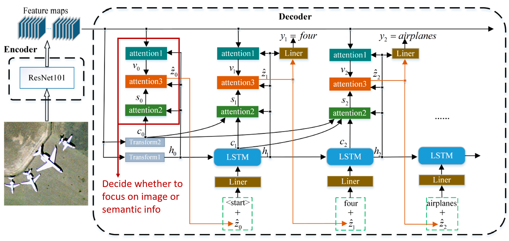

```{r setup, include=FALSE}
knitr::opts_chunk$set(echo = TRUE)
```
# Image Captioning of Earth Observation Imagery

A joint capstone project in coalition with MDA.

By Dora Qian, Fanli Zhou, James Huang, and Mike Chen. 

Special thanks to our mentor Varada, and our partners at MDA: Shun, and Andrew.

## Executive Summary

MDA is a Canadian aerospace company, manufacturing equipment for space applications, specializing in space surveillance, space robotics, and satellite systems. MDA has access to a vast database of overhead satellite images, and they are interested in assigning captions to these images for image indexing. In this project, we aim to create a tool that generates captions for overhead satellite photos, and manages and updates a database of these images.
 
## Introduction

In contrast with image classification -- which aims to sort images into predetermined buckets established by the training set -- image captioning is more dynamic and the generated sentence can often be novel to the training set. MDA's uncaptioned photos without context do not offer very much information on their own, and can be difficult and costly to work with. By extracting a caption from an image, it becomes much easier to work with in analysis. Applications of image captioning include image indexing and querying, evaluation of image similarity, and describing images to the visually impaired. In doing so, we will face challenges, as most image models currently available are trained on traditional ImageNet type images, due to the fundamentally differing nature of satellite images, transfer learning will be less effective as we are working on a different domain. MDA currently has no existing solution to this problem, so our work will be novel to the company. 

To break the problem down, we will be working with other, captioned datasets first. We will clean and organize the data into a database, and run the initial training and validation process on that data. We have access to several different datasets, and those will be used to test cross dataset performance. Once we're satisfied with the performance on the captioned datasets, we'll manually evaluate the performance on the MDA dataset by using the model to generate captions, and then score those captions by hand.

## Final Data Product Description

The final data product is a complete image captioning pipeline consisting of three independent modules: a database, a deep learning model and an interactive visualization and database updating tool. 

```{r echo=FALSE, out.width='100%'}
knitr::include_graphics('../imgs/dataproduct.png')
```

Figure 1. Final data product

First, the non-relational database will be used to store all the remote sensing images, associated captions and evaluation scores. We will start by creating three separate folders storing these data for ease of extraction. Both the human-annotated and machine-generated data will be stored in this database. 

Second, the deep learning model will be capable of loading data from the database, as well as train and predict on data. The model will be designed to be easily maintain and update. PyTorch will be used for modelling and AWS P2 or P3 instances will be used for cloud computing.

Lastly, a Dash-based visualization will allow users to get predicted captions from the model and update new image-caption pairs in the database. Users will have two options, either to select one or multiple images from the database or upload any new ones outside the database. The images, machine-generated captions, human-annotated captions and evaluation scores will be displayed as outputs. For existing images, the evaluation metrics will be BLEU and other ones based on semantic similarity. For new images, a  model confidence socre will be displayed.

```{r echo=FALSE, out.width='80%'}
knitr::include_graphics('../imgs/tool.png')
```

Figure 2. Visualization and database updating tool
 
## Data Description 

In order to train our model, we have three labeled datasets: UCM-captions, RSICD and Sydney-captions. All of the three datasets include captions and images. There are up to 5 different captions that accompany each image in the datasets. In a single dataset, the file format and size of the images are the same, but across datasets they differ. Which is why we must first standardize all images across the three datasets, before applying data science techniques.

The UCM-captions dataset is based off of the “University of California Merced’s Land Use Dataset”. It contains land-uses satellite images. There are 21 different classes of images. (2100 images)

The Sydney-captions dataset is extracted from a large 18000 X 14000 pixel image of Sydney taken from Google Earth. Each of the images in the dataset are selected and cropped from the original much larger Google Earth image. There are 7 different classes of images in this dataset, comprised of residential, airport, river, oceans, meadow, industrial and runway images. (613 images)

The RSICD dataset (Remote Sensing Imaging Captioning Dataset) is the state of the art dataset, the images are sourced from BaiduMaps, GoogleMaps and Tianditu. The captions are sourced from volunteers, and every image will include different captions, from different volunteers to ensure diversity of the caption. (10,922 images)

## Data Science Techniques Description 

We will combine all three datasets and split the combined dataset into training (64%), validation (16%), and test (20%) datasets. Stick to the golden rule, we will train and tune models with the training and validation datasets only. We decided to focus on the encoder-decoder model as it is the most common method for images captioning. Here are the three encoder-decoder models we will try:

1. Our baseline model is a CNN + LSTM encoder-decoder model, which uses heavy transfer learning (Figure 3). Given an image, a feature vector is extracted using the pre-trained [`InceptionV3` model](https://www.tensorflow.org/api_docs/python/tf/keras/applications/InceptionV3), a CNN trained on `ImageNet`. For LSTM, we use an embedding layer and initialize embedding weights with pre-trained `GloVe` embeddings. At each time step during generation, we combine the LSTM output with the image feature vector and pass the result through a dense layer and an output layer to generate the next word, which is fed back as input to the LSTM layer in the next time step. Our current model is trained with only 800 training examples ([source code](https://github.com/UBC-MDS/591_capstone_2020-mda-mds/blob/master/notebooks/baseline_model_tensorflow.ipynb), written in `TensorFlow`). 3B shows a good caption (`BLEU` score = 0.7) and 3C shows a bad caption (`BLEU` score = 0) generated by the model. We see that the baseline model does not do well on some images. The problem could be that unlike natural images, remote sensing images usually have strange views and many objects, and thus require detailed captions to capture all objects [@zhang_2019]. So we need to improve the model. 

```{r echo=FALSE, out.width='100%'}
knitr::include_graphics('../imgs/model_1_baseline_examples.png')
```

Figure 3. The baseline model architecture and example outputs. A is adapted from [@Lu_2018].

2. The second model will have an attention structure on top of the baseline model (Figure 4). The attention structure takes image features from the CNN convolutional layer and assigns weights to those features. Overall, it could act as moving the focus across the image so that the model can capture more features or objects and produce a better caption [@xu2015attend; @zhang_2019]. We will try this architecture and would expect this model to produce more detailed captions compared to the baseline.

```{r echo=FALSE, out.width='100%'}
knitr::include_graphics('../imgs/model_2.png')
```

Figure 4. The second model architecture (adapted from [@zhang_2019]).

3. As an extension of the second model, the third model will contain three attention structures on top of the baseline model (Figure 5). This multi-level attention model better mimics human attention mechanisms and act as moving the focus between the image and the word context to help generate better captions [@li_2020]. We are going to implement this architecture and expect this model to produce captions of the best quality.

```{r echo=FALSE, out.width='100%'}

```

Figure 5. The third model architecture (adapted from [@li_2020]).


If time permits, we could explore other model architectures and try fine-tuning pre-trained cross-modal models. To assess those models, we can use some evaluation metrics suggested in this paper [@li_2020], including `BLEU`, `Meteor`, `ROUGE_L`, `CIDEr`, and `SPICE`. We will first test our models with the `BLEU` score, which compares sentences based on n-grams. However, in this project, we want to focus on the semantic similarity other than the syntactic similarity. So we will then move to metrics that measure semantic similarity instead. Finally, we will test our best model with the test dataset and evaluate the results.

## Timeline and Evaluation:

The length of our capstone project is two months, starting from May 4th, 2020 to June 30th,  2020. During these eight weeks, the following five milestones are expected to be achieved: proposal, EDA and database design, model development, visualization tool design and polish. The first two weeks were used for the proposal: we have delivered both a presentation and a written report. Meanwhile, we will start exploratory data analysis, data pre-processing, and database design. The next four weeks will be used for data product development. The three intermediate stages would be run in parallel during this period. Both the database and tool design will take about two weeks while the deep model development will run for four weeks. Three milestones will be achieved by the end of this data product development stage. The last two weeks will be used to improve and polish the final product based on feedback from our mentor, and our partners. We will deliver the final presentation, final written report and final data products to both our MDS mentor and our MDA partners by June 29th, 2020.
 
```{r echo=FALSE, out.width='100%'}
knitr::include_graphics('../imgs/timeline.png')
```

Figure 6. Project timeline

## Reference


