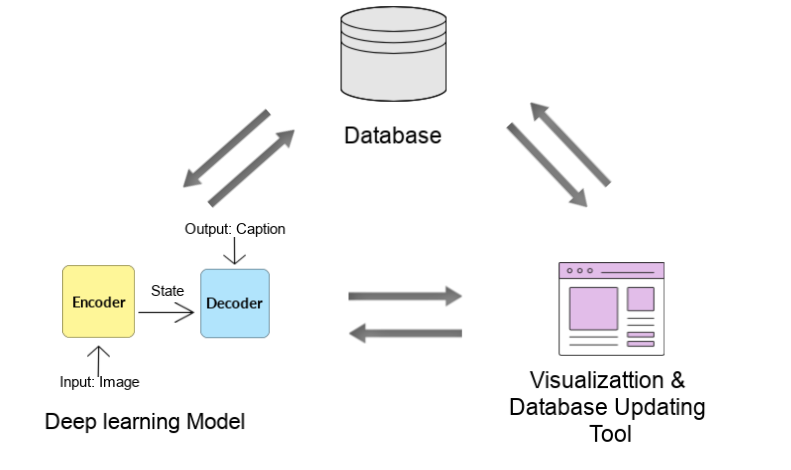

Proposal
================

## Executive Summary

Image captioning of earth observation imagery: this is our joint
capstone project in coalition with MDA. By Dora Qian, Fanli Zhou, James
Huang, and Mike Chen. Special thanks to our mentor Varada, and our
partners at MDA: Shun, and André.

In this project, we aim to create a novel tool that generates captions
for overhead satellite image, and manages and updates a database of
these images.

## Introduction

MDA is a Canadian aerospace company, manufacturing equipment for space
applications, specializing in space surveillance, space robotics, and
satellite systems. MDA has access to a vast database of the
aforementioned satellite images. These uncaptioned photos without
context do not offer very much information on their own, and are
difficult and costly to work with, as people naturally query things with
words. By extracting a caption from an image, it becomes much easier to
work with in analysis. These captions can allow images to be easily
tagged and sorted, they can be used in a search query, used to evaluate
image similarity, and other downstream applications in machine learning,
such as natural language processing. In doing so, we will face
challenges, as most image models currently available are trained on
traditional ImageNet type images, due to the fundamentally differing
nature of satellite images, knowledge transfer will be less effective as
we are working on a different domain. MDA currently has no existing
solution to this problem, so our work will be novel to the company. To
break the problem down, we will be working with other, captioned
datasets first. We will clean and organize the data into a database, and
run the initial training and validation process on that data. We have
access to several different datasets, and those will be used to test
cross dataset performance. Once we’re satisfied with the performance on
the captioned datasets, we’ll manually evaluate the performance on the
MDA dataset by using the model to generate captions, and then score
those captions by hand.

## Final Data Product Description

The final data product is a complete image captioning pipeline
consisting of three independent modules: a database, a deep learning
model and an interactive visualization and database updating tool.

Figure 1. Final data product

First, the non-relational database is used to store all the remote
sensing images, associated captions and evaluation scores. We would
start by creating three separate folders storing these data for the
easy-extracting purpose. Both the human-annotated and machine-generated
data would be stored in this database.

Second, the deep learning model will have the functions of loading data
from database, training and prediction. Moreover, the model would be
easy to maintain and update. PyTorch would be used for modelling and AWS
P2 or P3 instances would be used for cloud computing.

Last, a Dash-based visualization would allow users to get predicted
captions from the model and update new image-caption pairs back into the
database. Users would have two options, either to select one or multiple
images from the database or upload any new ones outside the database.
The images, machine-generated captions, human-annotated captions and
scores would be displayed as results.

Figure 2. Visualization and database updating tool

## Data Description

In order to train our model, we have three labeled datasets. The three
labeled datasets are UCM\_captions, RSICD and Sydney\_captions.

The UCM\_captions dataset is based off of the “University of California
Merced’s Land Use Dataset”. It contains land-uses satellite images.
There are 21 different classes of images ranging from airplane fields,
baseball diamond, overpass, runways and many more. There are 100 images
in every class, and each image has a resolution of 256 X 256 pixels.
(2100 images)

The Sydney\_captions dataset is extracted from a large 18000 X 14000
pixel image of Sydney taken from Google Earth. Each of the images in the
dataset are selected and cropped from the original much larger Google
Earth image.There are 7 different classes of images in this dataset,
which comprises of residential, airport, river, oceans, meadow,
industrial and runway images. Each image has a resolution of 500 X 500
pixels. (613 images)

The RSICD dataset (Remote Sensing Imaging Captioning Dataset) is the
state of the art dataset, which contains images captured from airplanes
and satellites. The captions are sourced from volunteers, and every
image will include 5 different captions, from 5 different volunteers to
ensure diversity of the caption. Each image has a resolution of 224 X
224 pixels. (10,922 images)

Each of the datasets ontain different image file types and images sizes.
In order to apply our data science techniques, we must first standarized
all the images across all three datasets.

## Data Science Techniques Description

We are going to split our dataset into training, validation, and test
datasets. Stick to the golden rule, we will train and tune models with
the training and validation datasets only. We decided to focus on the
encoder-decoder model as it’s the most common method for images
captioning. Here are the three encoder-decoder models we will try:

1.  Our first model will be a basic encoder-decoder (CNN + LSTM) model
    (Fig. 3). We’ll first use transferring learning to train this model.
    We’ve trained a baseline model with `InceptionV3` for CNN and
    `Glove` for word embedding using only 800 training examples ([source
    code](https://github.com/UBC-MDS/591_capstone_2020-mda-mds/blob/master/notebooks/baseline_model_tensorflow.ipynb),
    written in `TensorFlow`). Fig. 3C shows a good caption and 2D shows
    a bad caption generated by the model. We see that the baseline model
    does not do well on some images. The problem could be that unlike
    natural images, remote sensing images usually have strange views and
    many components, and thus require very detailed captions. So we need
    to improve the
model.

Figure 3. The baseline model architecture and example outputs. A is
adapted from (Lu et al. 2018).

2.  The second model will have an attention structure on top of the
    baseline model (Fig. 4). The attention structure takes image
    features from the CNN convolutional layer and assigns weights to
    those features. Overall, it could act as moving the focus across the
    image so that the model can capture more details and produce a
    better caption (Xu et al. 2015; Zhang 2019). We will try this
    architecture and would expect this model to produce more detailed
    captions compared to the
baseline.

Figure 4. The second model architecture (adapted from (Zhang 2019)).

3.  As an extension of the second model, the third model will contain
    three attention structures on top of the baseline model (Fig. 5).
    This multi-level attention model better mimics human attention
    mechanisms and act as moving the focus between the image and the
    word context to help generate better captions (Li 2020). We are
    going to implement this architecture and expect this model to
    produce captions of the best
quality.

Figure 5. The third model architecture (adapted from (Li 2020)).

If time permits, we could explore other model architectures and try
fine-tuning pre-trained cross-modal models. To assess those models, we
can use some evaluation metrics suggested in this paper (Li 2020),
including BLEU, Meteor, ROUGE\_L, CIDEr, and SPICE. Finally, we will
test our best model with the test dataset and evaluate the results.

## Timeline and Evaluation:

The length of our capstone project is two months, starting from May 4th,
2020 to June 30th, 2020. During these eight weeks, the following five
milestones are expected to be achieved: proposal, EDA and database
design, model development, visualization tool design and polishing. The
first two weeks would be used for the proposal, we plan to deliver both
a presentation and a written report. Meanwhile, we would start the
exploratory data analysis, data pre-processing and database design. The
next four weeks would be used for data product development. The three
intermediate stages would be run in parallel during this period. Both
the database and tool design would run for about two weeks while the
deep model development would run for four weeks. Three milestones would
be achieved by the end of this data product development stage. The last
two weeks would be used to improve and polish the final product based on
feedback from our mentor and partners. We would deliver the final
presentation, final written report and final data products to both MDS
mentor and MDA partners by June 29th, 2020.

Figure 6. Project timeline

## Reference

Li, S.; Jiao, Y.; Fang. 2020. “A Multi-Level Attention Model for Remote
Sensing Image Captions.” *Remote Sens.* 12 (6): 939.
<https://doi.org/10.3390/rs12060939>.

Lu, Xiaoqiang, Binqiang Wang, Xiangtao Zheng, and Xuelong Li. 2018.
“Exploring Models and Data for Remote Sensing Image Caption
Generation.” *IEEE Transactions on Geoscience and Remote Sensing* 56
(4). Institute of Electrical; Electronics Engineers (IEEE): 2183–95.
<https://doi.org/10.1109/tgrs.2017.2776321>.

Xu, Kelvin, Jimmy Ba, Ryan Kiros, Kyunghyun Cho, Aaron Courville, Ruslan
Salakhutdinov, Richard Zemel, and Yoshua Bengio. 2015. “Show, Attend and
Tell: Neural Image Caption Generation with Visual Attention.”

Zhang, X.; Tang, X.; Wang. 2019. “Description Generation for Remote
Sensing Images Using Attribute Attention Mechanism.” *Remote Sens.* 11
(6): 612. <https://doi.org/10.3390/rs11060612>.

