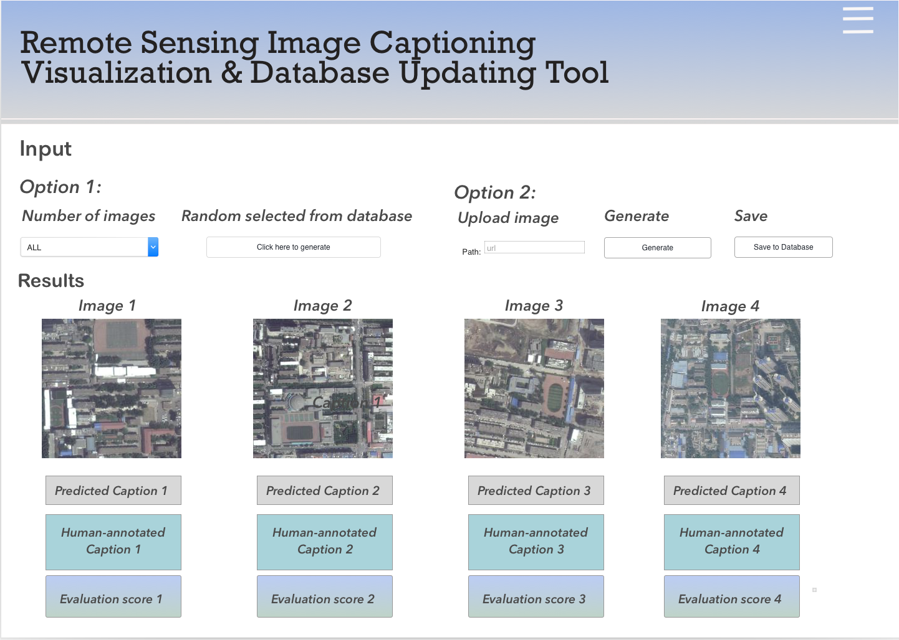

Proposal: Image Captioning of Earth Observation Imagery
================
Dora Qian, Fanli Zhou, James Huang and Mike Chen

*MDS Mentor: Varada Kolhatkar*

*MDA Partners: Andrew Westwell-Roper, Shun Chi*

## Executive Summary

MDA is a Canadian aerospace company, manufacturing equipment for space
applications, specializing in space surveillance, space robotics, and
satellite systems. MDA has access to a vast database of uncaptioned
overhead satellite images, and they are interested in assigning captions
to these images for image indexing, more specifically for detection of
events of interest; these captions will describe objects in the photo
and how they interact. In this project, we aim to create deep learning
models that generate these captions for overhead satellite photos, and
manages and updates a database of these image-caption pairs. We will
also create an interactive visualization tool that displays captions
generated for images and their respective evaluation scores.

## Introduction

In contrast with image classification – which aims to classify images as
predetermined classes established by the training set – image captioning
is more dynamic; it aims to generate sentences describing objects and
actions in the image. Image captions can be useful in a variety of
applications, such as image indexing for querying images and evaluating
image similarity, and describing images to the visually impaired. Most
image captioning models currently available are trained on traditional
`ImageNet` type images; due to the fundamentally different nature of
satellite images, transfer learning will be less effective as we are
working on a different domain. MDA currently has no existing solution to
this problem, so our work will be novel to the company.

To break the problem down, three public captioned datasets will be used.
We will merge them into one, clean and organize the data into a
database. Both training and testing will be performed using this
combined dataset. Once we are satisfied with the performance on this
dataset, the model will be tested on the MDA dataset.

## Final Data Product Description

The final data product is a complete image captioning pipeline
consisting of three independent modules: a database, a deep learning
model and an interactive visualization and database updating tool.

Figure 1. Final data product

First, the non-relational database will be used to store all the remote
sensing images, associated captions and evaluation scores. We will start
by creating three separate folders storing these data for ease of
extraction. Both the human-annotated and machine-generated data will be
stored in this database.

Second, the deep learning model will be capable of loading data from the
database, as well as train and predict on data. The model will be
designed to be easily maintain and update. `PyTorch` will be used for
modelling and AWS P2 or P3 instances will be used for cloud computing.

Lastly, a Dash-based visualization will allow users to get predicted
captions from the model and update new image-caption pairs in the
database. Users will have two options, either to select one or multiple
images from the database or upload any new ones outside the database.
The images, machine-generated captions, human-annotated captions and
evaluation scores will be displayed as outputs. For existing images, the
evaluation metrics will be `BLEU` and other ones based on semantic
similarity. For new images, a model confidence score will be displayed.

Figure 2. Visualization and database updating tool. Remote sensing
images are adapted from RSICD dataset (Lu et al. 2018).

## Data Description

In order to train our model, we have three labelled datasets:
UCM-captions (Qu et al. 2016), RSICD (Lu et al. 2018) and
Sydney-captions (Qu et al. 2016). All of the three datasets include
captions and images. There are up to 5 different captions that accompany
each image in the datasets. In a single dataset, the file format and
size of the images are the same, but across datasets they differ. Which
is why we must first standardize all images across the three datasets,
before applying data science techniques.

The UCM-captions dataset is based on the “University of California
Merced’s Land Use Dataset”. It contains land-uses satellite images.
There are 21 different classes of images. (2100 images)

The Sydney-captions dataset is extracted from a large 18000 X 14000
pixel image of Sydney taken from Google Earth. Each of the images in the
dataset are selected and cropped from the original much larger Google
Earth image. There are 7 different classes of images in this dataset,
comprised of residential, airport, river, oceans, meadow, industrial and
runway images. (613 images)

The RSICD dataset (Remote Sensing Imaging Captioning Dataset) is the
state of the art dataset, the images are sourced from BaiduMaps,
GoogleMaps and Tianditu. The captions are sourced from volunteers, and
every image will include different captions, from different volunteers
to ensure diversity of the caption. (10,922 images)

## Data Science Techniques Description

We will combine all three datasets and split the combined dataset into
training (64%), validation (16%), and test (20%) datasets. Stick to the
golden rule, we will train and tune models with the training and
validation datasets only. We decided to focus on the encoder-decoder
model as it is the most common method for images captioning. Here are
the three encoder-decoder models we will try:

1.  Our baseline model is a CNN + LSTM encoder-decoder model, which uses
    heavy transfer learning (Figure 3). Given an image, a feature vector
    is extracted using the pre-trained [`InceptionV3`
    model](https://www.tensorflow.org/api_docs/python/tf/keras/applications/InceptionV3),
    a CNN trained on `ImageNet`. For LSTM, we use an embedding layer and
    initialize embedding weights with pre-trained `GloVe` embeddings. At
    each time step during generation, we combine the LSTM output with
    the image feature vector and pass the result through a dense layer
    and an output layer to generate the next word, which is fed back as
    input to the LSTM layer in the next time step. Our current model is
    trained with only 800 training examples ([source
    code](https://github.com/UBC-MDS/591_capstone_2020-mda-mds/blob/master/notebooks/baseline_model_tensorflow.ipynb),
    written in `TensorFlow`). In figure 3, B shows a good caption
    (`BLEU` score = 0.7) and C shows a bad caption (`BLEU` score = 0)
    generated by the model. We see that the baseline model does not do
    well on some images. The problem could be that unlike natural
    images, remote sensing images usually have strange views and many
    objects, and thus require detailed captions to capture all objects
    (Zhang 2019). So we need to improve the model.

Figure 3. The baseline model architecture and example outputs. A is
adapted from (Lu et al. 2018).

2.  The second model will have an attention structure on top of the
    baseline model (Figure 4). The attention structure takes image
    features from the CNN convolutional layer and assigns weights to
    those features. Overall, it could act as moving the focus across the
    image so that the model can capture more features or objects and
    produce a better caption (Xu et al. 2015; Zhang 2019). We will try
    this architecture and expect this model to produce better captions
    compared to the baseline.

Figure 4. The second model architecture (adapted from (Zhang 2019)).

3.  As an extension of the second model, the third model will contain
    three attention structures on top of the baseline model (Figure 5).
    This multi-level attention model better mimics human attention
    mechanisms and act as moving the focus between the image and the
    word context to help generate better captions (Li 2020). We are
    going to implement this architecture and expect this model to
    produce captions of the best quality.

Figure 5. The third model architecture (adapted from (Li 2020)).

If time permits, we could explore other model architectures and try
fine-tuning pre-trained cross-modal models. To assess those models, we
can use some evaluation metrics suggested in this paper (Li 2020),
including `BLEU`, `Meteor`, `ROUGE_L`, `CIDEr`, and `SPICE`. We will
first test our models with the `BLEU` score, which compares sentences
based on n-grams. However, in this project, we want to focus on the
semantic similarity other than the syntactic similarity. So we will then
move to metrics that measure semantic similarity instead. Finally, we
will test our best model with the test dataset and evaluate the results.

## Timeline and Evaluation

The length of our capstone project is two months, starting from May 4th,
2020 to June 30th, 2020. During these eight weeks, the following five
milestones are expected to be achieved: proposal, EDA and database
design, model development, visualization tool design and polish. The
first two weeks were used for the proposal: we have delivered both a
presentation and a written report. Meanwhile, we will start exploratory
data analysis, data pre-processing, and database design. The next four
weeks will be used for data product development. The three intermediate
stages would be run in parallel during this period. Both the database
and tool design will take about two weeks while the deep model
development will run for four weeks. Three milestones will be achieved
by the end of this data product development stage. The last two weeks
will be used to improve and polish the final product based on feedback
from our mentor, and our partners. We will deliver the final
presentation, final written report and final data products to both our
MDS mentor and our MDA partners by June 29th, 2020.

Figure 6. Project timeline

## References

Li, S.; Jiao, Y.; Fang. 2020. “A Multi-Level Attention Model for Remote
Sensing Image Captions.” *Remote Sens.* 12 (6): 939.
<https://doi.org/10.3390/rs12060939>.

Lu, Xiaoqiang, Binqiang Wang, Xiangtao Zheng, and Xuelong Li. 2018.
“Exploring Models and Data for Remote Sensing Image Caption
Generation.” *IEEE Transactions on Geoscience and Remote Sensing* 56
(4). Institute of Electrical; Electronics Engineers (IEEE): 2183–95.
<https://doi.org/10.1109/tgrs.2017.2776321>.

Lu, X., B. Wang, X. Zheng, and X. Li. 2018. “Exploring Models and Data
for Remote Sensing Image Caption Generation.” *IEEE Transactions on
Geoscience and Remote Sensing* 56 (4): 2183–95.

Qu, B., X. Li, D. Tao, and X. Lu. 2016. “Deep Semantic Understanding of
High Resolution Remote Sensing Image.” In *2016 International Conference
on Computer, Information and Telecommunication Systems (Cits)*, 1–5.

Xu, Kelvin, Jimmy Ba, Ryan Kiros, Kyunghyun Cho, Aaron Courville, Ruslan
Salakhutdinov, Richard Zemel, and Yoshua Bengio. 2015. “Show, Attend and
Tell: Neural Image Caption Generation with Visual Attention.”

Zhang, X.; Tang, X.; Wang. 2019. “Description Generation for Remote
Sensing Images Using Attribute Attention Mechanism.” *Remote Sens.* 11
(6): 612. <https://doi.org/10.3390/rs11060612>.

